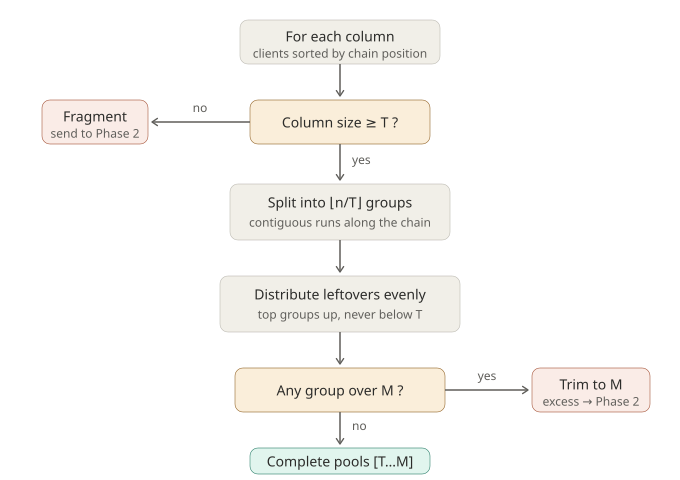
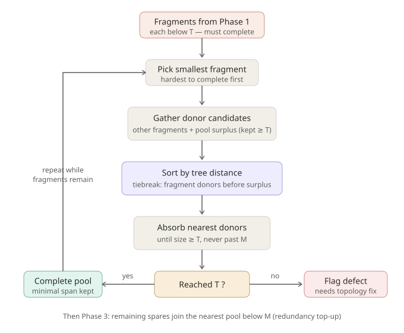

# Network topology & client-pool grouping — complete specification

Single-file spec. Companion code in this repository: `grouping.py` (reference
implementation) and `test_grouping.py` (96-assertion suite). Diagrams referenced
below live alongside this file as SVGs.

**Contents**

- **Parts I–II — Topology & grouping design** (narrative): device types, connection
  rules, data/redundancy model, priority stack, algorithm with pseudocode and
  decision flows, worked examples, edge-case checklist.
- **Part III — Implementation specification**: self-contained instructions for
  building the algorithm from scratch (agent-ready), including ground-truth
  verification cases and open design forks.
- **Part IV — Test scenario matrix**: every scenario with setup, parameters, and
  expected outcome.
- **Part V — Mirror-mode extension** (forward-looking, out of current scope).

---

# Parts I–II — Topology & grouping design

### Device types

| Abbrev. | Name | Definition |
|---------|------|------------|
| **RCD** | Root controller device | Top of the hierarchy. Heads one or more daisy chains directly and/or feeds one or more ADDs. |
| **ADD** | Area distribution device | Aggregation point for an area. Takes a single RCD uplink and heads one or more daisy chains. The RCD treats it as one downstream node. |
| **CHD** | Chain device | A device with an internal switch, daisy-chained in series (CHD → CHD → CHD). Passes traffic through to the next CHD and carries clients. |
| **CLD**  | Client | An end host attached to a CHD. Uniquely numbered across the topology (C1, C2, …). Clients may also daisy-chain off one another (CLD → CLD → …). |

### Connection rules

1. An **RCD** heads one or more chains directly, and/or one or more ADDs. (Redundant RCDs are possible; an ADD still accepts only one.)
2. An **ADD** has exactly **one** RCD uplink and heads **one or more** chains. An ADD can sit anywhere a chain node could, so areas can nest.
3. **CHDs** connect in series to form a chain. The head CHD of a chain attaches to either an RCD or an ADD.
4. Each **CHD** has **0–6 clients directly attached** in a star (a CHD may carry none). This count is the clients wired straight to the CHD; any clients daisy-chained further downstream (see rule 6) do **not** count toward the CHD's 0–6.
5. **Clients** are unique across the whole topology (C1, C2, C3, …).
6. A **client may daisy-chain off another client** (CLD → CLD → …). A downstream client attaches to the upstream client rather than directly to the CHD; the chain still originates at a CHD.

### Hierarchy at a glance

```
RCD ──┬── ADD ──┬── chain: CHD → CHD → CHD → …   (each CHD: 0–6 CLD directly attached)
      │         └── chain: CHD → CHD → CHD → …
      │
      └───────────── chain: CHD → CHD → CHD → …   (direct off RCD)

CHD ──┬── CLD
      └── CLD → CLD → …   (clients may daisy-chain off one another)
```

### Current example

- RCD 1 → ADD 1 → CHD 1 → CHD 2 → CHD 3
- RCD 1 → ADD 1 → CHD 4 → CHD 5 → CHD 6
- RCD 1 → CHD 7 → CHD 8 → CHD 9  *(direct chain, bypasses the ADD)*
- Clients C1–C13 distributed across the CHDs (1–2 shown per CHD; real range is 0–6, so some CHDs may have none).

---

## Data redundancy and client pooling

### Data model

- The **RCD holds the full data set** (the seed / authoritative copy).
- A **client has less capacity than the RCD** and cannot hold the full data set alone.
- Clients can be **combined into a pool** whose members together hold one full copy of the data set (each member holds a shard).
- A client reads data from **its local pool first**; the RCD is a fallback source only.

### Access priority

1. **Local pool** — always the first source.
2. **RCD** — fallback only.

Because the RCD can go down, the RCD must **not** be a dependency for availability. Every client must therefore belong to a pool that holds a *complete* copy on its own.

### Pool sizing terms

| Term | Meaning |
|------|---------|
| **Target Pool Size** (`T`) | User-specified. The minimum number of clients whose shards reconstruct the full data set. A pool with `< T` members is an **incomplete** copy and is secretly RCD-dependent. |
| **Max Pool Size** (`M`) | Hard limit determined by **client type**. A pool may not exceed `M` members. |
| **Complete pool** | A pool with `T ≤ size ≤ M`. Holds a full local copy; survives an RCD/root outage. |
| **Fragment** | A set of clients that is not (yet) part of a complete pool. |

### Grouping objective (priority stack — single-tree scope)

Applied in strict order:

1. **Every client belongs to a complete pool** (`size ≥ T`). Availability floor — no client may rest RCD-dependent. Non-negotiable.
2. **Over-provision toward `M` where clients allow.** In the single-tree scope this is the *only* redundancy lever: a pool larger than `T` tolerates the loss of individual clients without becoming incomplete. Spend leftover clients here.
3. **Minimize cross-chain span.** Proximity (network locality) is optimized only after 1 and 2 are satisfied, to avoid unnecessary daisy-chain traffic.

> **Scope note.** This stack assumes a **single tree**: one RCD, single ADDs, no mirror/failover paths present. In this scope, **RCD/root outage is survivable** (local pools serve data) and **client loss is survivable** (via over-provisioning), but **ADD failure and RCD-as-network-path failure are NOT survivable** — those require the mirror-mode topologies (see the extension at the end). Do not rely on any ADD or the RCD network path staying up.

## Data set sharding and shard assignment

The pool-size terms above have a concrete data meaning:

- The data set is **split into exactly `T` parts** ("shards", numbered 1…T). That is
  *why* `T` is the minimum complete pool size: one member per shard.
- When a group is formed, **each member is assigned one shard number** and holds that
  partial data set.
- **Invariant:** every pool must cover **all `T` shards** — a full data set must exist
  within the pool. Pools larger than `T` carry **duplicate** shards; the duplicates are
  where client-loss tolerance physically lives (losing a member whose shard is
  duplicated costs nothing; losing a uniquely-held shard makes the pool incomplete).
  Duplicates are spread round-robin from shard 1 so no shard is over-duplicated.

### CHD shard diversity (`chdShardDiversity` flag)

User-controlled flag governing how shard numbers are placed onto the clients of each
**chain device (CHD)**:

| `chdShardDiversity` | Behavior | Intent |
|---|---|---|
| `true` | Clients on the same CHD are assigned shards **as diverse as possible** (greedy: never repeat a shard on a CHD while an unused one remains in the pool's multiset). | Multicast-friendly: every shard stream traveling the chain finds a recipient at nearly every CHD. |
| `false` (default) | No CHD constraint; plain in-order assignment. | Leaves room for the opposite strategy (clustering same shards per CHD to prune per-stream multicast trees) if later specified. |

**Diversity is a cross-pool property.** Pools are contiguous runs, so a CHD's clients
usually share a pool — but a CHD at a pool boundary can straddle two pools, and the
diversity goal still applies across them: those clients should hold different shard
numbers where possible. Shard assignment therefore runs *after* all pools are formed
(Phase 4), tracking used-shards **per CHD globally**, not per pool.

**Input consequence:** the topology input must carry CHD grouping (which clients sit
on which CHD), not just flat column order. Flat input remains legal (each client
treated as its own CHD, making the flag a no-op).

### Grouping rules (as specified)

- Groups are formed **≥ `T`**, up to **`M`**.
- If a column's clients divide **evenly into groups of `T`**, that is the best case.
- **Leftover clients** (after dividing a column into `T`-sized groups) are **distributed evenly across that column's groups**, growing them toward `M`. Leftovers top groups *up*; they never form a sub-`T` group.
- Groups are **contiguous runs** along the chain, so "even distribution" never scatters one pool across the daisy chain.
- A column with **fewer than `T`** clients cannot self-complete and **must merge outward** — this is mandatory, not optional.
- **Partner selection when merging:** **proximity is primary** (nearest clients first); **incomplete-vs-surplus is the tiebreaker** (at equal distance, prefer combining two incomplete fragments over drawing from a surplus column, which keeps surplus columns' core pools local and resolves two deficits at once).
- Any fragment that **cannot reach `T`** even after exhausting all reachable clients is a **hard availability defect** — flag it (topological fix: add clients, or accept documented RCD-dependence). Never silently leave a group below `T`.

---

## Grouping algorithm (single-tree scope)

### Decision flow

**Phase 1 — local pooling.** *Note: the diagram shows the per-column view; the current design (see "Why census → virtual chain → flexible k" below) first merges each deficient column with a same-junction neighbor into a virtual chain, then applies this same split logic to the merged whole with a flexibly chosen group count.* Columns/chains either self-complete into pools or emit fragments; there is no other exit.



**Phase 2 — mandatory fragment completion.** Loops smallest-fragment-first. The sort step encodes the core rule: **tree distance is the primary key; fragment donors beat surplus donors only at equal distance.** Each fragment leaves through exactly one of two exits — complete pool, or flagged availability defect. There is deliberately no third exit: a fragment can never rest below `T`. Phase 3 (spares topping pools toward `M`) has no branching and is noted at the bottom.



### Proximity metric

Tree distance between two clients:

- **Same chain:** number of hops along the daisy chain between them.
- **Different chains:** hops up to the **lowest common ancestor** (shared ADD, or the RCD) and back down.

This makes "two chains under the same ADD are closer than a chain under a different ADD or hanging directly off the RCD" fall out automatically — which is exactly the cross-chain-traffic intuition.

### Pseudocode

```text
INPUT:
  clients[]         # every client in the tree
  T                 # Target Pool Size (user-specified)
  maxOf(clientType) # M, hard cap per client type
  tree              # ancestor paths (chain, ADD, RCD) + positions
  allowDissolve     # user flag: may an unfixable fragment be dissolved
                    # into nearby pools with headroom? (default: false)

# ---- Phase 0: annotate + deficiency census ----
for c in clients:
    c.column   = c.chain                 # the daisy chain it belongs to
    c.pos      = position_along_chain(c) # for contiguity + proximity
    c.domain   = (c.RCD, c.ADD, c.chain) # fault-domain path (used in mirror mode)

# CENSUS: find deficient columns BEFORE any chunking commits.
# A deficient column will force a merge somewhere — so its neighbors
# must not chunk in isolation.
deficient = [ col for col in columns(clients) if len(col) < T ]

# ---- Phase 1: build virtual chains, then cut ----
# MERGEABILITY RULE: columns sharing a junction (same ADD, or both
# direct off the RCD) may concatenate into ONE virtual chain, joined
# at that junction. Anything farther apart is NOT mergeable here and
# falls back to Phase 2.
units = []
for col in columns(clients):
    if col not in deficient:
        units.add( VirtualChain([col]) )             # ordinary column

for col in deficient:
    partner = nearest_mergeable_column(col)          # same junction; prefer
                                                     # another deficient col
                                                     # at equal distance
    if partner exists:
        # Concatenate through the junction: order clients by walk
        # distance through it — deficient column's clients nearest the
        # junction first, then the partner column head → tail. The
        # junction is the SEAM: the cheapest place to stitch.
        merge col into partner's VirtualChain (seam-ordered)
    else:
        fragments.add( Fragment(col.clients) )       # isolated -> Phase 2

groups    = []
fragments = fragments or []

for vc in units:
    members = vc.clients                             # already seam-ordered
    N       = len(members)
    M       = min(maxOf(t) for t in member_client_types(members))

    # FLEXIBLE k: choose the group count from the feasible range,
    # not a hardcoded floor(N/T).
    feasible_k = [ k for k in ceil(N/M) .. floor(N/T)
                   if N can split into k parts each in [T, M] ]

    if feasible_k is empty:                          # N unpartitionable
        k = floor(N / T)                             # salvage what fits...
        chunks = split_contiguous(members, max(k,1))
        pool the chunks that land in [T, M]
        fragments.add( Fragment(the sub-T remainder) )  # ...rest -> Phase 2
        continue

    k = pick from feasible_k                         # prefer the cut whose
                                                     # sizes best serve the
                                                     # priority stack (see
                                                     # "Choosing the cut")
    chunks = split_contiguous(members, k)            # k contiguous runs,
                                                     # sizes within [T, M],
                                                     # leftovers spread evenly
    groups.add( Pool(chunk) for chunk in chunks )

# ---- Phase 2 (FALLBACK): donor completion for what virtual chains
#      could not express — isolated columns, multi-junction merges,
#      unpartitionable N ----
while fragments has any F with size(F) < T:
    F = fragments.pop_smallest()                     # hardest first

    candidates = other_fragments(fragments)
        + surplus_clients(groups)                    # clients a pool can shed
                                                     # WITHOUT dropping below T

    # PRIMARY key: proximity.  TIEBREAK: incomplete fragments before surplus.
    candidates.sort( key = ( tree_distance(F, x),
                             0 if x.from_fragment else 1 ) )

    for x in candidates:
        if size(F) >= T: break
        if size(F) + 1 > M: break                    # respect cap
        move x into F
        if x drained a fragment: remove it from fragments
        if x was surplus: shrink its source pool (still >= T)

    if size(F) >= T:
        groups.add( Pool(F) )                        # completed, minimal span
        continue

    # ---- Dissolve fallback (user-controlled) ----
    # Fragment cannot reach T via donors. If the user permits, salvage its
    # members individually instead of stranding the whole fragment.
    if allowDissolve:
        for c in sort_by(F.members, key = pos):      # nearest-first
            p = nearest_pool_below_M(c, groups)      # pool with headroom
            if p exists:
                move c into p                        # absorbed at [T+1 .. M]
        if F.members is empty:
            continue                                 # fully salvaged
        FLAG_DEFECT(F.members)                       # only the unplaceable rest
    else:
        FLAG_DEFECT(F)                               # whole fragment stranded ->
                                                     # not survivable; needs
                                                     # topology fix or allowDissolve

# ---- Phase 3: redundancy top-up (priority-stack rule 2) ----
for c in unassigned_surplus(clients):
    p = nearest_pool_below_M(c, groups)
    if p exists:
        move c into p                                # raises client-loss tolerance
    # else: leave as spare (or FLAG if it is stranded below T on its own)

# ---- Phase 4: shard assignment ----
# Runs after ALL pools are final. chd_used is GLOBAL (cross-pool), so a CHD
# straddling two pools still avoids shard repeats under diversity.
chd_used = {}                                        # chd -> set of shards present
for P in groups (members in chain order):
    multiset = {1..T} + round-robin duplicates for the (|P| - T) extras
    if chdShardDiversity:
        for c in P:
            s = lowest shard in multiset NOT in chd_used[c.chd]   # fresh if possible
                else lowest shard remaining in multiset           # forced repeat
            assign c -> s; remove s from multiset; chd_used[c.chd] += s
    else:
        assign sorted(multiset) to P in order       # no CHD constraint
# Postcondition: every pool's assigned shards cover {1..T}. Defect clients
# receive NO shard (they are not in a pool).

OUTPUT:
  groups            # each a complete pool, size in [T, M]
  defects           # regions that cannot form a complete pool
```

#### The `allowDissolve` flag

When a fragment can find no donors (no other fragments, no pool with surplus above `T`), there are two possible outcomes, and **which one is correct depends on intent the algorithm cannot infer** — so the user chooses:

| `allowDissolve` | Behavior | Trade-off |
|---|---|---|
| `false` (default) | The whole fragment is flagged as a defect. Its clients stay RCD-dependent, but **grouping intent is preserved**: the fragment's clients remain together and unassigned, ready to form their intended pool once the topology is fixed (e.g. clients added). | More stranded clients now; cleaner recovery later. |
| `true` | Fragment members are pushed **individually, nearest-first**, into existing pools with headroom (`< M`). Only members with no reachable headroom are flagged. | Minimizes stranded clients now — but scatters the fragment, may create long-path pool members, and a later topology fix requires regrouping. |

**Feasibility note.** Some populations are arithmetically unpartitionable: full coverage requires the total client count to be expressible as a sum of pool sizes in `[T, M]`. E.g. with `T=5, M=6`, reachable totals are 5, 6, 10, 11, 12, 15, 16, 17, … — **13 is not reachable**, so at least one client *must* be stranded regardless of strategy. The defect handler can (and should) report the gap: how many clients to add, or how far to lower `T`, to reach the nearest feasible total. The census in Phase 0 can detect this **before** chunking, which is earlier and cleaner than discovering it fragment-by-fragment.

#### Why census → virtual chain → flexible k (design rationale)

The earlier design chunked each column in isolation and repaired deficits afterward with donors. That is *correct* but can be globally *ugly*: greedy per-fragment absorption can assemble a **"Franken-pool"** — complete, but drawing members from the head, middle, and tail of different chains, with maximal internal span (see the size-14 + size-1 worked example below). The root cause: **Phase 1 committed to a chunking before knowing a fragment was waiting next door.**

The redesign fixes the timing, not the greed:

1. **Census first.** Identify deficient columns before anything chunks. A deficient column *will* force a merge; its future partner must not chunk in isolation.
2. **Virtual chain through the junction.** A deficient column and a mergeable neighbor concatenate into one logical chain, joined at their shared junction (the ADD, or the RCD for direct chains), with clients ordered by walk distance through it. The junction is the **seam** — the cheapest stitch point — so the deficient column's clients group with the *head* of the partner column, never its far tail.
3. **Flexible k.** Cut the virtual chain choosing the group count from the feasible range (`⌈N/M⌉ … ⌊N/T⌋`, keeping every part in `[T, M]`) rather than hardcoding `⌊N/T⌋`. This also fixes an independent weakness: fixed `⌊n/T⌋` sometimes forces trimming when a different k splits cleanly.

A column with no deficient neighbor is simply a virtual chain of one column, so this **subsumes** the old Phase 1 rather than special-casing it. Phase 2's donor machinery remains as the fallback for what a virtual chain cannot express: isolated deficient columns (no same-junction partner), multi-junction merges, and unpartitionable totals (where dissolve/defect still apply).

**Choosing the cut.** When several k or size arrangements are feasible, the tie is broken by the priority stack: prefer cuts that place the larger (slack-bearing) groups where fragility hurts most — in particular, bias the *minimum-size* (`= T`, zero-loss-tolerance) group **away from the seam group**, since the seam group is the one containing cross-chain members and is costliest to repair. (This resolves the "at-`T` fragility placed by geography" observation from the clean boundary case.)

**Mergeability boundary.** Only columns sharing a junction concatenate — same ADD, or both direct off the RCD. Columns under *different* ADDs never form a virtual chain; their combination (if forced) goes through Phase 2 donors, keeping the expensive cross-ADD decision explicit rather than buried in a linearization.

### Worked intuition (target `T = 4`, cap `M = 6`)

- A column of **8** clients → two groups of 4. Best case (even split).
- A column of **10** → `floor(10/4)=2` groups; the 2 leftovers top the groups up to **5 + 5** (both still ≤ `M`). No fragment.
- A column of **3** → deficient; the whole column is a fragment and must merge with the **nearest** clients that bring it to 4, preferring another deficient column at equal distance.
- A column of **13** → three groups of 4, remainder 1. That single leftover tops one group to **5**, or if all three are already being topped, becomes a fragment for Phase 2.

### Worked example: cross-column donation (`T = 4`, `M = 6`)

Setup — two columns under the same ADD, clients numbered head-of-chain → end:

- **Column 1:** clients 1–10
- **Column 2:** clients 11–13

**Phase 1:**

- Column 1: `n = 10 ≥ T` → `⌊10/4⌋ = 2` groups; the 2 leftovers distribute evenly → **[1–5]** and **[6–10]** (5 + 5). No fragment.
- Column 2: `n = 3 < T` → whole column becomes fragment **[11, 12, 13]**.

**Phase 2:** the fragment needs 1 client. No other fragments exist, so candidates are **surplus** clients (both pools are size 5, each can shed one while staying ≥ `T`). Sorted by tree distance to column 2, the nearest donor is **client 1** — it sits at the head of column 1, closest to the shared ADD. Donating from the chain-head end also keeps the donor pool contiguous ([2–5]).

**Result:**

| Group | Members | Size | Cross-chain? |
|-------|---------|------|--------------|
| G1 | 2, 3, 4, 5 | 4 | no |
| G2 | 6, 7, 8, 9, 10 | 5 | no |
| G3 | 1, 11, 12, 13 | 4 | 1 client, shortest path |

**The rejected alternative:** split column 1 as [1–4], [5–8] and merge the tail with column 2 → [9, 10, 11, 12, 13]. Same group count, but the merged pool has **two** far-side clients instead of one (6 cross-ADD member-pairs vs 3), and clients 9–10 sit at the *far end* of the chain, so their shard reads traverse the full chain plus the ADD. Phase 1 topping leftovers up-front, then Phase 2 donating from the nearest edge, steers to the cheaper shape.

**Caveats this example exposes (open decisions):**

- The resolution **shrinks a formed pool** (G1 loses client 1). If formed pools must be immutable for stability, Phase 2 cannot use surplus donors, and this case would instead force the tail merge or an explicit re-chunk of column 1.
- "Nearest donor" assumes client IDs follow chain position. If IDs don't encode position, the algorithm needs actual `pos` data — it would pick whichever client is physically nearest the ADD, regardless of numbering.

### Worked example: no donors available — the dissolve decision (`T = 5`, `M = 6`)

Same layout, higher target:

- **Column 1:** clients 1–10
- **Column 2:** clients 11–13 (same ADD)

**Phase 1:**

- Column 1: `⌊10/5⌋ = 2` groups, zero leftover → **[1–5]** and **[6–10]**, both *exactly* at `T`.
- Column 2: fragment **[11, 12, 13]**, needing 2.

**Phase 2:** the fragment's candidate list is **empty** — no other fragments, and no surplus (both pools sit at `T`; neither can shed a client without breaking the floor). The donor loop cannot help. The outcome now depends on `allowDissolve`:

**With `allowDissolve = false` (default):**

| Group | Members | Size |
|-------|---------|------|
| G1 | 1–5 | 5 |
| G2 | 6–10 | 5 |
| **Defect** | **11, 12, 13** | 3 stranded, kept together |

**With `allowDissolve = true`:** members are pushed nearest-first into pools with headroom (both can grow 5 → 6):

| Group | Members | Size | Note |
|-------|---------|------|------|
| G1 | 1–5, 11 | 6 | absorbs nearest member |
| G2 | 6–10, 12 | 6 | costly path: full column 2 + ADD + full column 1 |
| **Defect** | **13** | 1 stranded — unavoidable (see below) |

**Why a defect exists either way:** 13 total clients is **not partitionable** with `T=5, M=6` — reachable totals are 5, 6, 10, 11, 12, 15, 16, 17, …; 13 is a gap. At least one stranded client is mathematically forced. Dissolving reduces the stranded count from 3 to the theoretical minimum of 1, at the cost of scattering column 2's clients into long-path pool memberships. The defect report should state the fix: the nearest feasible totals are 12 (remove a client / it is stranded anyway) or **15 (add 2 clients)** — or lower `T` to 4, which makes 13 partitionable (4+4+5).

### Worked example: the clean boundary case (`T = 5`, `M = 6`)

- **Column 1:** clients 1–12
- **Column 2:** clients 13–17 (same ADD)

**Phase 1:**

- Column 1: `⌊12/5⌋ = 2` groups, remainder 2, distributed evenly → **[1–6]** and **[7–12]**. Both land *exactly* at `M` — legal.
- Column 2: `n = 5 = T` exactly → one clean group **[13–17]**.

**Phase 2:** no fragments exist — nothing to do. `allowDissolve` is never consulted.

**Result:**

| Group | Members | Size | Client-loss tolerance |
|-------|---------|------|----------------------|
| G1 | 1–6 | 6 | 1 (6 → 5 ≥ T) |
| G2 | 7–12 | 6 | 1 |
| G3 | 13–17 | 5 | **0** (any loss → below T) |

All 17 clients pooled, zero cross-chain traffic, no defects. The shape is forced: 17 has exactly one decomposition into parts in `[5, 6]` (5+6+6), so the only freedom was placement — and keeping both 6s in column 1 avoids any cross-column pool.

**Two observations:**

1. **This sits on a cliff edge.** Remainder 2 across 2 groups lands both exactly at `M`. Had column 1 held **13** clients (remainder 3), even distribution would try 6+7, overflow the cap, trim to 6+6, and spin off a 1-client fragment — which finds no donors (G3 has no surplus) and lands on the dissolve decision. 12 is the last population where column 1 stays self-contained.
2. **At-`T` fragility is placed by geography, not by choice.** Some pool *must* sit at exactly `T` (the decomposition forces it), and the algorithm puts it wherever the `T`-sized column happens to be. G3 tolerates zero client losses while G1/G2 each tolerate one. If client reliability varies by type or location, a possible Phase 3 extension is to rebalance one client across pools so the at-`T` fragility lands in the least risky spot — at the cost of one cross-chain membership. Not implemented; flagged for when client-reliability data exists.

### Worked example: the Franken-pool — why the virtual chain exists (`T = 5`, `M = 6`)

- **Column 1:** clients 1–14
- **Column 2:** client 15 only (same ADD)

**The old design (chunk in isolation, repair with donors):**

- Phase 1: column 1 → `⌊14/5⌋ = 2` chunks → 7+7 → both overflow `M` → trim to **[1–6]**, **[7–12]**, excess fragment **[13, 14]**. Column 2 → fragment **[15]**.
- Phase 2: fragment [15] absorbs by greedy proximity — one surplus client from each pool (both at 6, each can shed one) plus the [13, 14] fragment:

| Group | Members | Character |
|-------|---------|-----------|
| G1 | 2–6 | local |
| G2 | 8–12 | local |
| G3 | 1, 7, 13, 14, 15 | **Franken-pool** — head, middle, and tail of column 1 plus column 2; maximal internal span |

Complete, no defects — but G3 is the worst-performing pool the topology could express. **Completeness and coherence came apart**: every greedy step was locally nearest, yet the composition is globally ugly. The cause is timing — column 1 committed to 6+6 before Phase 2 knew a 1-client fragment was waiting next door.

**The redesigned algorithm (census → virtual chain → flexible k):**

- Census: column 2 is deficient (1 < 5). Its same-junction partner is column 1.
- Virtual chain, seam-ordered through the ADD: `15 → 1 → 2 → … → 14` (client 15 sits one hop from the junction; client 1 is column 1's head — the seam stitches them).
- Flexible k on N = 15: feasible k range is `⌈15/6⌉ = 3 … ⌊15/5⌋ = 3` → k = 3, sizes 5+5+5. Cut the line:

| Group | Members | Character |
|-------|---------|-----------|
| G1 | **15, 1, 2, 3, 4** | seam group — one cross-junction member, adjacent clients |
| G2 | 5, 6, 7, 8, 9 | local, contiguous |
| G3 | 10, 11, 12, 13, 14 | local, contiguous |

Same sizes, same completeness — dramatically less span. Only client 15 crosses the junction, and only to reach the clients immediately on the other side of it. This case is the reason the census/virtual-chain design replaced isolated per-column chunking.

---

## Edge cases for testing (implementation checklist)

Full scenario matrix with expected outcomes lives in Part IV;
a reference implementation and passing suite (96 assertions) in `grouping.py` /
`test_grouping.py`. This checklist is the condensed index for a production test plan.

### Covered by the current suite (categories A–J)

1. **Even split** — column divides exactly into `T`-sized groups (8 @ T=4 → [4,4]).
2. **Leftover top-up** — remainder distributed upward, never a sub-`T` group (10 @ T=4 → [5,5]).
3. **Column exactly at `T`** — single pool, zero loss tolerance.
4. **Column exactly at `M`** — single pool at cap.
5. **Flexible k prefers slack** — when multiple cuts are feasible, fewer/larger pools win (12 @ T=5 → [6,6], not [4,4,4]-style shapes).
6. **Flexible k avoids needless trims** — sizes chosen from the feasible range, not hardcoded `⌊n/T⌋` (13 @ T=4 → [4,4,5]).
7. **Virtual-chain merge, single deficient client** — the Franken-pool fix (14+1 @ T=5 → [15,1–4],[5–9],[10–14] exactly).
8. **Virtual-chain merge, deficient column** — seam pool stitches at the junction using the partner's *head*, never its far tail (10+3 @ T=4).
9. **Donor path with surplus** — deficit resolved from pools above `T` (12+4 @ T=5).
10. **No-donor wall, strict** — headroom exists but surplus does not; whole fragment stranded *together* (`allowDissolve=false`, 10+3 @ T=5 → defect [11,12,13]).
11. **No-donor wall, dissolve** — members salvaged nearest-first to arithmetic minimum stranding (10+3 @ T=5 → [6,6] + defect [13]).
12. **Dissolve showcase** — all pools reach `M`, one forced defect (15+4 @ T=5).
13. **Infeasible totals detected up front** — 13 and 19 unpartitionable at T=5/M=6; defect report names nearest feasible totals (12/15 and 18/20 → "one client away from clean").
14. **Multiple deficient columns, same junction** — deficients pair with each other first (3+2+12 @ T=5 → {1–5} pooled).
15. **Deficient columns under different ADDs** — never virtual-chained; resolved (or not) explicitly via Phase 2 donors/dissolve.
16. **RCD as junction** — direct-off-RCD chains merge like same-ADD chains.
17. **Empty column** — legal (CHDs may carry 0 CLDs), ignored.
18. **Lone client** — defect in strict mode; still a defect under dissolve when no pool with headroom exists anywhere.
19. **Empty topology** — vacuous success.

### Known-divergence case (decide, then pin with a test)

20. **Seam-size trade** — 10+3 @ T=4: virtual chain yields seam `[13,12,11,1,2]` (size 5, more loss tolerance, 6 cross-junction pairs); the donor-era result was `[1,11,12,13]` (size 4, 3 cross-junction pairs). "Choosing the cut" currently favors slack; flip `seam_larger` if traffic should win. Whichever is chosen, pin it.

### Pending spec decisions (blocked — write tests once decided)

21. **Mixed client types** — per-type `M` lowering a merged unit's cap (`M = min` over member types); untested until real type data exists. Include a case where merging *lowers* `M` enough to change feasibility.
22. **Pool immutability / stability** — if formed pools may not shrink, donor tests (9) and dissolve tests (11, 12) change behavior; hysteresis tests (single client join/leave must not reshuffle pools) belong here too.
23. **CLD daisy-chains** — the proximity metric does not yet define where a chained client sits (is a CLD hanging off another CLD at parent position + 1?). Define, then test: chained clients splitting across a pool boundary; a chain of CLDs longer than `T`.
24. **Multi-deficient pairing order** — greedy pairing can pick wrong when order changes feasibility (e.g. deficient sizes where pairing A+B strands C but A+C and B+? recover everyone). Needs exhaustive-pairing or backtracking treatment; add adversarial cases.
25. **`allowDissolve` × immutability interaction** — dissolve requires growing formed pools; under immutability it must run pre-finalization as a re-chunk. Test both orderings once decided.
26. **Fragility placement** — biasing the at-`T` (zero-loss-tolerance) pool toward the least risky location when client reliability varies; blocked on reliability data existing.

### Shard assignment (Phase 4)

28. **Shard coverage invariant** — every pool covers shards {1..T} under both flag settings; duplicates round-robin; defect clients unsharded. *(covered: suite category K)*
29. **CHD diversity on/off** — diversity=true yields max distinct shards per CHD, including **cross-pool** on straddling CHDs; diversity=false unconstrained. *(covered: category K)*
30. **Diversity=false semantics** — unconstrained today; active same-shard clustering per CHD is a possible third mode. *(pending decision — see Part III §9.5)*
31. **Flat vs nested input** — flat client lists remain legal (each client its own CHD; diversity a no-op). *(covered: category K)*

### Out of scope (by design)

27. **Mirror mode** — fault-domain spreading, populated-vs-bare failover, dual-path tagging. Test plan belongs to the mirror-mode extension when that hardware is in scope.

---

# Part III — Implementation specification

**Audience:** an implementer (human or agent) building this from scratch. This file is
self-contained: everything needed to implement and verify the algorithm is here.
Context files (optional): Parts I–II of this document,
`grouping.py` (reference implementation), `test_grouping.py` (96-assertion suite),
Part IV (scenario matrix).

---

### 1. Problem statement

A tree-shaped network distributes a data set held in full by a **root controller
device (RCD)**. Clients (**CLD**) cannot hold the full set individually, but a group
("pool") of them can, each member holding a shard. Clients read from their pool first;
the RCD is a fallback that must be assumed able to fail. Therefore:

> **Invariant I1:** every client must belong to a pool large enough to reconstruct the
> full data set locally — or be explicitly reported as a defect. No client may silently
> depend on the RCD.

The algorithm's job: given the topology and pool-size parameters, partition all
clients into pools that satisfy I1 while minimizing cross-chain network traffic and
maximizing tolerance to individual client loss.

### 2. Topology model (input)

The physical hierarchy is RCD → optional ADD (area distribution device) →
daisy-chained CHDs (chain devices) → clients. For this algorithm, it reduces to:

```
Column  := one daisy chain of clients, ordered head → tail.
           The HEAD is the end nearest the chain's attachment point.
Junction := the attachment point of a column: an ADD id, or the literal
           token "RCD" for chains hanging directly off the root.
```

**Input schema** (any equivalent structure is fine):

```
columns: map<column_id, { junction: string,
                          clients: [[client_id, ...], ...]   # nested: one inner
                        }>                                   # list per CHD,
         # CHDs and clients in head → tail order; may be empty.
         # A flat list [client_id, ...] is also legal (each client is then
         # treated as its own CHD, making chdShardDiversity a no-op).
T:       int   # Target Pool Size — the data set is split into exactly T shards;
               # T is therefore the minimum clients that reconstruct it
M:       int   # Max Pool Size — hard cap (per client type; see §9.1)
allowDissolve:     bool  # user flag, default false — see §6
chdShardDiversity: bool  # user flag, default false — see §6.4
```

**Output schema:**

```
pools:   [[client_id, ...], ...]   # every pool has T <= size <= M
defects: [[client_id, ...], ...]   # stranded clients, grouped as stranded
shards:  map<client_id, int 1..T>  # shard assignment; defect clients absent
report:  feasibility info + trace  # see §7
```

**Postconditions to assert:** (a) every input client appears in exactly one pool or
one defect set; (b) every pool size is in `[T, M]`; (c) defects are empty iff the
total is partitionable AND no column was isolated beyond repair; (d) every pool's
assigned shards cover the full set {1..T}; (e) exactly the pooled clients appear
in `shards`.

### 3. Core math

#### 3.1 Partitionability

A count `n` is **partitionable** iff it can be written as a sum of parts each in
`[T, M]`. Test: some `k` in `[ceil(n/M) .. floor(n/T)]` satisfies `k*T <= n <= k*M`.

```
feasible_ks(n, T, M) = [ k in ceil(n/M) .. floor(n/T)  where  k*T <= n <= k*M ]
partitionable(n)     = feasible_ks(n, T, M) is non-empty     (n >= T required)
```

Example (T=5, M=6): reachable totals are 5, 6, 10, 11, 12, 15, 16, 17, 18, 20, …
— **13, 14, 19 are gaps.** If the grand total of clients sits in a gap, at least one
client is stranded *no matter what the algorithm does*. Detect this up front (§7).

#### 3.2 Splitting sizes

Given `n` and a chosen `k`, sizes are near-equal: `base = n div k`, `extra = n mod k`
→ `extra` parts of `base+1` and `k-extra` parts of `base`. All parts land in `[T, M]`
by construction when `k` is feasible.

**Choosing k when several are feasible:** pick the **smallest** k (fewest, largest
pools). Rationale: a pool above `T` tolerates client loss (size can drop to `T` and
stay complete); this is the only redundancy lever in scope (priority stack, §8).

**Ordering the sizes:** when the unit is a merged virtual chain (§5), put the
**larger** sizes at the seam end (start of the linearization) so the cross-junction
pool carries slack. This is a deliberate, documented trade — see §9.2 before locking it.

#### 3.3 Tree distance (proximity metric)

```
dist(a, b):
  same column:        |pos_a - pos_b|                    # hops along the chain
  same junction:      (pos_a + 1) + (pos_b + 1)          # up to junction, down
  different junction: (pos_a + 1) + (pos_b + 1) + C      # via the RCD; C = const > 0
```

`pos` is the 0-based index from the column head. The constant C only needs to make
cross-junction strictly costlier than same-junction; exact hop counts are optional
precision. Distance from a *set* (fragment/pool) to a client = min over members.

### 4. Algorithm overview

Three phases. Phase 1 does the heavy lifting; Phase 2 is a fallback; Phase 3 is
cosmetic.

```
Phase 0  Annotate clients (column, pos, junction) + deficiency census
         + grand-total feasibility check.
Phase 1  Build units (virtual chains), cut each with flexible k.
Phase 2  FALLBACK: complete leftover fragments via donors; then the
         user-controlled dissolve; else flag defects.
Phase 3  Optional: distribute any remaining spares to nearest pools below M.
```

**Design principle (why the census exists):** never chunk a column in isolation when
a deficient column is waiting nearby. Committing early produces "Franken-pools" —
complete but maximally-spanning pools assembled by greedy repair (§10, case 7 shows
the failure). Deciding merges *before* cutting reaches the global optimum cheaply.

### 5. Phase 1 — census, virtual chains, flexible-k cut

#### 5.1 Census

```
deficient = [ col for col in columns if 0 < |col| < T ]
```

Empty columns are legal (a CHD may carry zero clients); skip them entirely.

#### 5.2 Merge rule (mergeability boundary)

A deficient column may merge with **at most one partner column sharing the same
junction** (same ADD, or both direct off the RCD). Columns under *different*
junctions are NEVER merged in Phase 1 — forcing that combination through Phase 2
keeps the expensive cross-ADD decision explicit rather than hidden in a linearization.

Partner selection, in order:
1. Another **deficient** column at the same junction (resolves two deficits at once).
2. A **complete** column at the same junction.
3. Accept a partner **only if** `partitionable(|deficient| + |partner|)`. If merging
   would produce an unpartitionable unit, do NOT merge — send the deficient column to
   Phase 2 instead. (This keeps `allowDissolve` semantics meaningful: the strict/
   dissolve decision stays with the user rather than being pre-empted by a salvage
   split. See §10 case 4 vs case 7 for the two behaviors this preserves.)
4. No qualifying partner → the deficient column becomes a Phase 2 fragment whole.

Each column participates in at most one merge (pairwise only — see §9.4 for the
known limitation with 3+ deficient columns).

#### 5.3 Seam ordering (linearization)

A merged pair becomes one **virtual chain**, linearized as a walk through the
junction:

```
reversed(deficient column)  ++  partner column (head → tail)
   i.e.  deficient tail → deficient head → [junction] → partner head → partner tail
```

The junction is the **seam** — the cheapest stitch point. This guarantees the
deficient column's clients group with the partner's *head* clients (physically
adjacent through the junction), never its far tail.

Worked target (the case that motivated the design): column1 = clients 1–14,
column2 = [15], T=5, M=6. Linearization: `15, 1, 2, …, 14`. Cut k=3, sizes 5+5+5:

```
[15, 1, 2, 3, 4]   [5, 6, 7, 8, 9]   [10, 11, 12, 13, 14]
```

Only client 15 crosses the junction, and only to reach the clients immediately on
the other side. (Contrast with the greedy-repair result in §10 case 7.)

#### 5.4 Cutting

For every unit (merged virtual chain, or a plain unmerged column):

```
n  = |unit|
ks = feasible_ks(n, T, M)
if ks non-empty:
    k = min(ks)
    sizes = split_sizes(n, k)         # larger sizes at seam end if merged
    emit contiguous pools per sizes
else:                                  # unpartitionable unit (plain columns only,
                                       # merged units were pre-checked in 5.2)
    cover as much as possible: k = floor(n/T); pool k contiguous parts sized
    within [T, M] (max coverage = min(n, k*M)); the sub-T remainder (taken from
    the tail end) becomes a Phase 2 fragment.
```

Leftover distribution falls out of split_sizes automatically: remainders top pools
*up* toward M, never form a sub-T group, and pools are always contiguous runs.

### 6. Phase 2 — fallback: donors, then dissolve, then defect

Input: fragments (each `< T`). Process smallest first (hardest to complete).

#### 6.1 Donor loop

Candidates for a fragment F:
- members of **other fragments**;
- **surplus** clients of formed pools — a pool has surplus iff `size > T`
  (it can shed while staying complete). **Headroom (`size < M`) is NOT surplus** —
  headroom lets a pool receive, surplus lets it give. Confusing these two is the
  most likely implementation bug (see §10 cases 4 vs 5).
- To preserve contiguity, only a pool's **edge members** (first/last in its run)
  are sheddable.

Sort candidates by `dist(F, candidate)` ascending; tiebreak: fragment members
before surplus (draining two deficits beats shrinking a healthy pool). Absorb one
at a time, re-ranking after each move (distances change as F grows), until
`|F| >= T` or `|F| = M` or candidates are exhausted. If a donation empties another
fragment, remove it. A donating pool must never drop below T.

Completed F → emit as a pool.

#### 6.2 Dissolve fallback (user-controlled)

If F cannot reach T and `allowDissolve` is **true**: push F's members
**individually, nearest-first**, into existing pools with headroom (`size < M`),
each to its nearest such pool. Members with no reachable headroom anywhere → defect.

If `allowDissolve` is **false**: the whole fragment becomes a defect, **kept
together**. Rationale for the default: a stranded-but-intact fragment preserves
grouping intent — when the topology is later fixed (clients added), the fragment
becomes its intended local pool without regrouping. Dissolving scatters it and
requires a re-run to undo. The user opts *into* the lossier action.

#### 6.3 Defect

A defect is not a resting state — it is a region that cannot survive an RCD outage.
Always emit it in the report with the feasibility remedy (§7).

### 6.4 Phase 4 — shard assignment

The data set is split into exactly `T` shards (1..T); each pool member holds one.
Runs strictly after all pools are final (dissolve included), because diversity is a
**cross-pool, per-CHD** property.

```
chd_used = {}                              # chd -> shards already present (GLOBAL)
for each pool P, members in chain order:
    multiset = {1..T}
    for i in 0 .. |P|-T-1: multiset += (i mod T) + 1     # duplicates round-robin
    if chdShardDiversity:
        for c in P:
            fresh = lowest s in multiset with s not in chd_used[c.chd]
            s = fresh if it exists else lowest s remaining in multiset
            assign, remove from multiset, record in chd_used[c.chd]
    else:
        assign sorted(multiset) to members in order
```

Invariants: every pool covers {1..T} (the multiset construction guarantees it
regardless of the flag); defect clients get no shard. Under diversity, a repeat on
a CHD occurs only when forced (more co-located members than distinct shards
remaining). `chdShardDiversity = false` currently means *unconstrained*; an active
clustering mode (same shard grouped per CHD, to prune per-stream multicast trees)
is a possible third setting — see §9.6.

### 7. Reporting

Compute up front and attach to output:

```
total          = count of all clients
partitionable  = partitionable(total)
nearest_down   = largest  n' <= total with partitionable(n')
nearest_up     = smallest n' >= total with partitionable(n')
```

When defects exist, the report should state the remedy in operational terms:
"add (nearest_up - total) clients" and/or "lower T to <t'>" where t' is the largest
target making the total partitionable. Example: 19 clients at T=5/M=6 → "1 client
away from clean (20)". This turns the defect flag from an error into a
capacity-planning signal. Also emit a per-step trace (merge decisions, donor moves,
dissolve placements) — invaluable for debugging and for the divergence checks in §10.

### 8. Priority stack (conflict resolution)

When choices conflict, resolve in this strict order:

1. **Completeness** — every client in a pool of `>= T`, or an explicit defect.
2. **Loss tolerance** — prefer pools above `T` (smallest feasible k; leftovers top up).
3. **Locality** — minimize cross-chain/cross-junction span, subject to 1 and 2.

Locality is deliberately *last*. It governs partner choice and donor order, but never
justifies leaving a client below T or shrinking slack that rule 2 created.

### 9. Open decisions (implement the default, flag the fork)

These are unresolved in the spec. Implement the stated default; make each one
cheap to flip; surface them to whoever owns the requirements.

#### 9.1 Mixed client types
`M` is per client type; a mixed pool's cap is `min` over member types. Default:
compute it that way. Untested — no real type data yet. Watch for: a merge that
*lowers* M enough to change feasibility of the merged unit.

#### 9.2 Seam-size trade
Current rule gives the seam pool the *larger* size (slack where repair is
costliest). This increases cross-junction member-pairs vs giving it the smaller
size (e.g. 10+3 @ T=4: seam of 5 → 6 cross pairs, seam of 4 → 3). If traffic
should win over slack, reverse the size ordering. Either way: pin with a test.

#### 9.3 Pool immutability
The donor loop and dissolve both mutate formed pools. If pools must be immutable
once formed (stability/hysteresis), donors can only come from fragments and
dissolve must run pre-finalization as a re-chunk. Default: mutation allowed.

#### 9.4 Multi-deficient pairing order
Pairing is greedy (smallest deficient first). With 3+ deficient columns at one
junction, greedy order can strand clients that a different pairing would save
(pairing A+B leaves C infeasible while A+C and B+partner recover everyone).
Default: greedy; production should exhaustively try pairings when deficient
count at a junction exceeds 2 (the search space is tiny).

#### 9.5 Diversity=false semantics
`chdShardDiversity = false` is currently *unconstrained* assignment. If the
motivation for turning diversity off is active same-shard clustering per CHD
(pruning multicast trees per stream), that is a third mode, not the current false.
Default: unconstrained; consider an enum {diverse, unconstrained, clustered}.

### 9.6 CLD daisy-chains
Clients may chain off clients (CLD → CLD). Their `pos` in the proximity metric is
undefined. Proposed default: a chained client sits at `parent.pos` + chain depth.
Decide before topologies with client chains go live.

### 10. Verification cases (implement these as tests first)

All with M=6. `→` denotes required output. These are the ground-truth cases the
reference suite asserts; an implementation disagreeing with any of them is wrong
(except where §9 flags a deliberate fork).

| # | Setup | T | flag | Required outcome |
|---|-------|---|------|------------------|
| 1 | one column of 8 | 4 | — | pools [4,4] |
| 2 | one column of 10 | 4 | — | pools [5,5] (leftovers top up, never a sub-T group) |
| 3 | one column of 12 | 5 | — | pools [6,6] (smallest k wins over other cuts) |
| 4 | one column of 13 | 4 | — | pools [4,4,5] (flexible k; no trim, no fragment) |
| 5 | cols 1–10 and 11–13, same ADD | 4 | — | 0 defects; one pool contains all of {11,12,13} plus column-1 HEAD clients only |
| 6 | cols 1–10 and 11–13, same ADD | 5 | false | pools [5,5]; defect **[11,12,13] together** (13 unpartitionable; no surplus exists — both pools at exactly T) |
| 7 | cols 1–14 and [15], same ADD | 5 | — | pools **exactly** [15,1–4], [5–9], [10–14] |
| 8 | cols 1–10 and 11–13, same ADD | 5 | true | pools [6,6]; defect = one client |
| 9 | cols 1–15 and 16–19, same ADD | 5 | true | pools [6,6,6]; defect = one client (19 is a gap; 1 stranded is the forced minimum) |
| 10 | cols 1–15 and 16–19, same ADD | 5 | false | pools [5,5,5]; defect [16,17,18,19] together |
| 11 | cols of 3, 2, 12, same ADD | 5 | — | 0 defects; {1..5} = one pool (the two deficients merged with each other, not with the 12) |
| 12 | cols [1–3] under ADD1, [4–6] under ADD2 | 5 | true | one pool of 6 (via Phase 2 donors + dissolve — NEVER via a cross-ADD virtual chain) |
| 13 | cols [1–3] and [4–12], both junction=RCD | 5 | — | 0 defects (RCD is a junction like any ADD) |
| 14 | one empty column + one column of 5 | 5 | — | pools [5]; empty column ignored |
| 15 | a single lone client | 5 | either | defect [that client] (dissolve needs an existing pool with headroom; none exists) |
| 16 | empty topology | 5 | — | no pools, no defects |

| 17 | any pooled case above, either flag | — | — | every pool's shards cover {1..T}; defect clients unsharded |
| 18 | one column, CHDs [1,2,3],[4,5,6], T=3, diversity=true | 3 | — | each CHD holds 3 distinct shards |
| 19 | same, diversity=false | 3 | — | at least one CHD repeats a shard (pool of 6 at T=3 duplicates every shard) |
| 20 | column of 10 @ T=5 with a CHD straddling the [1–5]/[6–10] pool boundary, diversity=true | 5 | — | the straddling CHD's two clients hold different shards (cross-pool diversity) |

Also assert globally, on every case: coverage (each client in exactly one pool or
defect), size bounds, shard coverage per pool, and — for feasible totals with
same-junction columns — zero defects.

### 11. Reference-implementation pointers

`grouping.py` in this repository implements everything above (~200 lines, stdlib
only); `test_grouping.py` runs 96 assertions over the cases in §10 plus invariant
checks. Use them as an oracle: run both implementations on random topologies and
diff outputs. Divergences are acceptable only where §9 marks a fork — and then only
after the fork is decided and pinned.

---

# Part IV — Test scenario matrix

Companion to Parts I–III of this document. Every scenario below is implemented and
passing in `test_grouping.py` against the reference implementation `grouping.py`
(96 assertions, 0 failures). Parameters are `T` = Target Pool Size, `M` = 6 unless noted.

### A. Single-column basics

| # | Setup | T | Expected | Exercises |
|---|-------|---|----------|-----------|
| A1 | 8 clients | 4 | [4, 4] | even split, best case |
| A2 | 10 clients | 4 | [5, 5] | leftover top-up, never a sub-T group |
| A3 | 5 clients | 5 | [5] | column exactly at T |
| A4 | 6 clients | 5 | [6] | column exactly at M |
| A5 | 12 clients | 5 | [6, 6] | flexible k prefers fewer/larger pools (slack per priority-stack rule 2) over [4×3 → invalid] / [5,5,+2 frag] |

### B. Flexible k avoids needless trims

| # | Setup | T | Expected | Exercises |
|---|-------|---|----------|-----------|
| B1 | 13 clients | 4 | [4, 4, 5] | old fixed `⌊n/T⌋` would over-chunk; flexible k splits cleanly |
| B2 | 16 clients | 5 | [5, 5, 6] | k chosen from feasible range, sizes distributed evenly |

### C. Virtual-chain merges (deficient + same-junction partner)

| # | Setup | T | Expected | Exercises |
|---|-------|---|----------|-----------|
| C1 | col1 = 1–14, col2 = [15], same ADD | 5 | **[15,1–4], [5–9], [10–14]** | the Franken-pool fix: census + seam ordering + flexible k reach the global optimum |
| C2 | col1 = 1–10, col2 = [11–13], same ADD | 4 | seam pool holds all of col2 + col1 **head** clients | seam group stitches at the junction, never the far tail |

> **Observed divergence (C2):** the virtual-chain design yields seam pool `[13,12,11,1,2]`
> (size 5 — the "seam gets the larger size" cut rule), where the older donor-era worked
> example produced `[1,11,12,13]` (size 4, fewer cross-junction member-pairs: 3 vs 6).
> This is the documented slack-vs-traffic trade in "Choosing the cut": the current rule
> buys the seam group one client of loss tolerance at the cost of extra cross-junction
> pairs. Flip `seam_larger` if traffic should win.

### D. Donor fallback (surplus exists)

| # | Setup | T | Expected | Exercises |
|---|-------|---|----------|-----------|
| D1 | col1 = 1–12, col2 = 13–16, same ADD | 5 | all pooled, 0 defects (N=16 feasible → virtual chain) | deficit-of-one resolved without dissolve |

### E. No-donor wall + `allowDissolve`

| # | Setup | T | Flag | Expected | Exercises |
|---|-------|---|------|----------|-----------|
| E1 | col1 = 1–10, col2 = 11–13 | 5 | false | [5, 5] + defect **[11,12,13] kept together** | strict mode preserves grouping intent |
| E2 | same | 5 | true | [6, 6] + defect [13] | dissolve salvages to the arithmetic minimum |
| E3 | col1 = 1–15, col2 = 16–19 | 5 | false | [5,5,5] + defect [16–19] | headroom exists but surplus does not (headroom ≠ surplus) |
| E4 | same | 5 | true | [6,6,6] + defect [one client] | dissolve showcase: all pools reach M, minimum stranding |

### F. Infeasibility math (unit-level)

| # | Check | Expected |
|---|-------|----------|
| F1 | 13 partitionable at T=5, M=6? | no — reachable totals are 5, 6, 10–12, 15–18, … |
| F2 | 19 partitionable at T=5, M=6? | no — 3 parts max 18, 4 parts min 20 |
| F3 | nearest feasible to 13 | (12 down, 15 up) → "add 2 clients or lower T" |
| F4 | nearest feasible to 19 | (18 down, 20 up) → "**one** client away from clean" |

### G. Multiple deficient columns, same junction

| # | Setup | T | Expected | Exercises |
|---|-------|---|----------|-----------|
| G1 | cols of 3, 2, and 12 under one ADD | 5 | {1–5} as one pool (the two deficients merged), 12 → [6, 6] | deficient-prefers-deficient partner rule; the greedy pairing risk flagged in the doc |

### H. Deficient columns under different junctions (no virtual chain allowed)

| # | Setup | T | Flag | Expected | Exercises |
|---|-------|---|------|----------|-----------|
| H1 | [1–3] under ADD1, [4–6] under ADD2 | 5 | false | one pool of 5 via donors + defect [1] | cross-ADD merge stays explicit in Phase 2; mergeability boundary holds |
| H2 | same | 5 | true | single pool of 6, 0 defects | donors + dissolve together recover the feasible total |

### I. Direct-off-RCD junction

| # | Setup | T | Expected | Exercises |
|---|-------|---|----------|-----------|
| I1 | [1–3] and [4–12], both direct off the RCD | 5 | all pooled, 0 defects | "RCD" is a junction like any ADD for mergeability |

### J. Degenerate inputs

| # | Setup | Expected | Exercises |
|---|-------|----------|-----------|
| J1 | one empty column + one column of 5 | empty column ignored, [5] | 0-client columns are legal (CHDs may have 0 CLDs) |
| J2 | a single lone client, strict | defect [1] | total < T with no pools anywhere |
| J3 | a single lone client, dissolve | still defect [1] | dissolve needs a pool with headroom to exist |
| J4 | empty topology | no pools, no defects | vacuous case |

### Scenarios covered by design but worth adding when the spec settles

- **Mixed client types** (per-type `M` lowering a merged unit's cap) — the pseudocode
  computes `M = min over member types`, untested until real type data exists.
- **Multi-deficient pairing order** — G1 passes, but three-way cases where pairing
  order changes feasibility (e.g. sizes 2, 3, 4 with T=5: pairing 2+3 leaves 4 stranded
  while 2+4 and 3+... ) should get exhaustive-pairing treatment if they occur in practice.
- **Pool immutability / stability** (open decision) — no tests until decided; donor
  and dissolve tests would change under an immutable-pools rule.
- **Client daisy-chains (CLD → CLD)** — position/distance of chained clients is not yet
  defined in the proximity metric; tests pending that definition.
- **Mirror mode** — out of scope per the reference doc.

---

# Part V — Mirror-mode extension (forward-looking — NOT in the current example)


When a **mirror RCD** or a **second ADD** is present, cross-links between the ends of chains (normally traffic-blocked) become **failover uplinks** on detected failure: the column's normal uplink is disabled and the end-of-chain link becomes the uplink into the other tree. This turns ADD-failure and RCD-path-failure into *potentially* survivable events — and changes the grouping key.

### What changes

- **Fault domains become spreadable.** A pool survives an ADD outage only if its clients don't **all** share one ADD; survives an RCD outage only if they don't all share one RCD (**requires ≥ 2 RCDs** — impossible with a single root).
- **Partner-selection key flips.** Instead of "nearest client," the key becomes **"nearest client that adds a fault domain the pool does not yet cover."** Proximity drops to a tiebreaker *within* a fault-domain-satisfying set.
- **Spread-vs-traffic is a deliberate trade.** A pool that must survive any single ADD failure has to straddle ≥ 2 ADDs, which guarantees cross-ADD traffic on non-local reads. Maximal redundancy and minimal traffic cannot both hold; the objective chooses redundancy.

### Mirrors are not exact copies

The failover side is **whatever is there** — possibly a full parallel set of columns, possibly a lone ADD with no columns, possibly just the link. So a failover link guarantees **reachability**, not **redundancy**. Classify each region by what is actually reachable through its failover path:

| Tier | Condition | Survives |
|------|-----------|----------|
| **1 — Local complete pool** | pool complete within the tree | RCD / root loss, client loss |
| **2 — Cross-domain pool** | pool spread across a **populated** failover side | the above **+ ADD loss** (local copy still reconstructable) |
| **3 — Bare-link reachability** | failover side is **empty** (ADD-only or link-only) | ADD loss **only if the RCD/root is up** — reintroduces root dependence; weaker guarantee |

The grouper must **not** treat "has a failover link" as a boolean meaning "survivable." It must inspect the reachable population and record the tier, so each region's real guarantee is known rather than assumed uniform.

### Client tagging for mirror awareness

Tag every client with **two** ancestor paths, not one:

- **Normal path:** `(RCD, ADD, chain, pos)` — used in single-tree mode.
- **Failover uplink:** present whenever the chain is mirrored (the end-of-chain cross-link target).
- **Failover population:** the set of clients (possibly **empty**) reachable through that uplink. The grouper keys off this — an empty population means Tier 3 at best.

Pool completeness in mirror mode is checked against **both** states (normal and failed-over), so a pool that is complete today isn't silently broken when a cross-link re-homes its chain to the other tree.

> Doing the two-path tagging now costs nothing even in the single-tree example and avoids a re-model when mirror hardware is later added.
